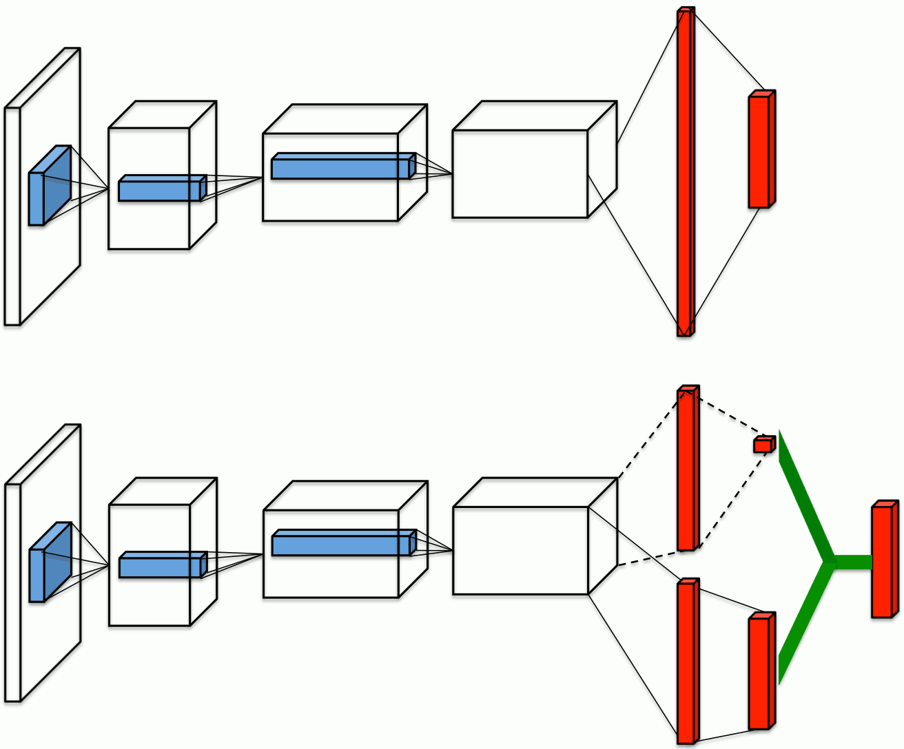

title: NPFL122, Lecture 5
class: title, langtech, cc-by-nc-sa
# Rainbow

## Milan Straka

### October 31, 2022

---
section: Refresh
# Function Approximation

We will approximate value function $v$ and/or state-value function $q$,
selecting it from a family of functions parametrized by a weight vector $→w ∈ ℝ^d$.

We denote the approximations as
$$\begin{gathered}
  v̂(s; →w),\\
  q̂(s, a; →w).
\end{gathered}$$

~~~
We utilize the _Mean Squared Value Error_ objective, denoted $\overline{VE}$:
$$\overline{VE}(→w) ≝ ∑_{s∈𝓢} μ(s) \left[v_π(s) - v̂(s, →w)\right]^2,$$
where the state distribution $μ(s)$ is usually on-policy distribution.

---
# Gradient and Semi-Gradient Methods

The functional approximation (i.e., the weight vector $→w$) is usually optimized
using gradient methods, for example as
$$\begin{aligned}
  →w_{t+1} &← →w_t - \tfrac{1}{2} α ∇_{→w_t} \big(v_π(S_t) - v̂(S_t; →w_t)\big)^2\\
           &← →w_t + α\big(v_π(S_t) - v̂(S_t; →w_t)\big) ∇_{→w_t} v̂(S_t; →w_t).\\
\end{aligned}$$

As usual, the $v_π(S_t)$ is estimated by a suitable sample of a return:
- in Monte Carlo methods, we use episodic return $G_t$,
- in temporal difference methods, we employ bootstrapping and use
  one-step return
  $$R_{t+1} + [¬\textrm{done}]⋅γv̂(S_{t+1}; →w)$$
  or an $n$-step return.

---
section: DQN
# Deep Q Network

Off-policy Q-learning algorithm with a convolutional neural network function
approximation of action-value function.

Training can be extremely brittle (and can even diverge).

---
# Deep Q Networks

- Preprocessing: $210×160$ 128-color images are converted to grayscale and
  then resized to $84×84$.
~~~
- Frame skipping technique is used, i.e., only every $4^\textrm{th}$ frame
  (out of 60 per second) is considered, and the selected action is repeated on
  the other frames.
~~~
- Input to the network are last $4$ frames (considering only the frames kept by
  frame skipping), i.e., an image with $4$ channels.
~~~
- The network is fairly standard, performing
  - 32 filters of size $8×8$ with stride 4 and ReLU,
  - 64 filters of size $4×4$ with stride 2 and ReLU,
  - 64 filters of size $3×3$ with stride 1 and ReLU,
  - fully connected layer with 512 units and ReLU,
  - output layer with 18 output units (one for each action)

---
# Deep Q Networks

- Network is trained with RMSProp to minimize the following loss:
  $$𝓛 ≝ 𝔼_{(s, a, r, s')∼\mathrm{data}}\left[(r + \left[¬\textrm{done}\right] ⋅ γ \max\nolimits_{a'} Q(s', a'; →θ̄) - Q(s, a; →θ))^2\right].$$
~~~
- An $ε$-greedy behavior policy is utilized (starts at $ε=1$ and gradually decreases to $0.1$).

Important improvements:
~~~
- **experience replay**: the generated episodes are stored in a buffer as $(s, a, r,
  s')$ quadruples, and for training a transition is sampled uniformly
  (off-policy training);
~~~
- separate **target network** $→θ̄$: to prevent instabilities, a separate _target
  network_ is used to estimate one-step returns. The weights are not trained,
  but copied from the trained network after a fixed number of gradient updates;
~~~
- reward clipping: because rewards have wildly different scale in different
  games, all positive rewards are replaced by $+1$ and negative by $-1$;
  life loss is used as end of episode.
  - furthermore, $(r + \left[¬\textrm{done}\right] ⋅ γ \max_{a'} Q(s', a'; →θ̄) - Q(s, a; →θ))$ is
    also clipped to $[-1, 1]$ (i.e., a $\textrm{smooth}_{L_1}$ loss or Huber loss).

---
class: tablefull
# Deep Q Networks Hyperparameters

| Hyperparameter | Value |
|----------------|-------|
| minibatch size | 32 |
| replay buffer size | 1M |
| target network update frequency | 10k |
| discount factor | 0.99 |
| training frames | 50M |
| RMSProp learning rate and momentum | 0.00025, 0.95 |
| initial $ε$, final $ε$ (linear decay) and frame of final $ε$ | 1.0, 0.1, 1M |
| replay start size | 50k |
| no-op max | 30 |

---
section: Rainbow
# Rainbow

There have been many suggested improvements to the DQN architecture. In the end
of 2017, the _Rainbow: Combining Improvements in Deep Reinforcement Learning_
paper combines 6 of them into a single architecture they call **Rainbow**.

~~~

---
section: DDQN
# Q-learning and Maximization Bias

Because behaviour policy in Q-learning is $ε$-greedy variant of the target
policy, the same samples (up to $ε$-greedy) determine both the maximizing action
and estimate its value.

~~~

---
# Double Q-learning

---
# Rainbow DQN Extensions

## Double Q-learning

Similarly to double Q-learning, instead of
$$r + γ \max_{a'} Q(s', a'; →θ̄) - Q(s, a; →θ),$$
we minimize
$$r + γ Q(s', \argmax_{a'}Q(s', a'; →θ); →θ̄) - Q(s, a; →θ).$$

~~~

---
# Rainbow DQN Extensions

## Double Q-learning

---
# Rainbow DQN Extensions

## Double Q-learning

---
# Rainbow DQN Extensions

## Double Q-learning

Performance on episodes taking at most 5 minutes and no-op starts on 49 games:

~~~
Performance on episodes taking at most 30 minutes and using human starts on 49
games:

---
section: PriRep
# Rainbow DQN Extensions

## Prioritized Replay

Instead of sampling the transitions uniformly from the replay buffer,
we instead prefer those with a large TD error. Therefore, we sample transitions
according to their probability
$$p_t ∝ \Big|r + γ \max_{a'} Q(s', a'; →θ̄) - Q(s, a; →θ)\Big|^ω,$$
~~~
where $ω$ controls the shape of the distribution (which is uniform for $ω=0$
and corresponds to TD error for $ω=1$).

~~~
New transitions are inserted into the replay buffer with maximum probability
to support exploration of all encountered transitions.

---
# Rainbow DQN Extensions

## Prioritized Replay

Because we now sample transitions according to $p_t$ instead of uniformly,
on-policy distribution and sampling distribution differ. To compensate, we
therefore utilize importance sampling with ratio
$$ρ_t = \left( \frac{1/N}{p_t} \right) ^β.$$

~~~
The authors utilize in fact “for stability reasons”
$$ρ_t / \max_i ρ_i.$$

---
# Rainbow DQN Extensions

## Prioritized Replay

---
section: Dueling
# Rainbow DQN Extensions

## Dueling Networks

Instead of computing directly $Q(s, a; →θ)$, we compose it from the following quantities:
- value function for a given state $s$,
- advantage function computing an **advantage** of using action $a$ in state $s$.

~~~
$$Q(s, a) ≝ V\big(f(s; ζ); η\big) + A\big(f(s; ζ), a; ψ\big) - \frac{\sum_{a' ∈ 𝓐} A(f(s; ζ), a'; ψ)}{|𝓐|}$$

---
# Rainbow DQN Extensions

## Dueling Networks

---
# Rainbow DQN Extensions

## Dueling Networks

---
# Rainbow DQN Extensions

## Dueling Networks

Results on all 57 games (retraining the original DQN on the 8 missing games).
`Single` refers to DDQN with a direct computation of $Q(s, a; →θ)$, `Clip`
corresponds to gradient clipping to norm at most 10.

---
section: $N$-step
# Rainbow DQN Extensions
## Multi-step Learning

Instead of Q-learning, we use $n$-step variant of Q-learning, which estimates
return as
$$∑_{i=1}^n γ^{i-1} R_i + γ^n \max_{a'} Q(s', a'; →θ̄).$$

~~~
This changes the off-policy algorithm to on-policy (because the “inner” actions
are sampled from the behaviour distribution, but should follow the target distribution);
however, it is not discussed in any way by the authors.

---
section: NoisyNets
# Rainbow DQN Extensions

## Noisy Nets

Noisy Nets are neural networks whose weights and biases are perturbed by
a parametric function of a noise.

~~~
The parameters $→θ$ of a regular neural network are in Noisy nets represented as
$$→θ ≈ →μ + →σ ⊙ →ε,$$
where $→ε$ is zero-mean noise with fixed statistics. We therefore learn the
parameters $(→μ, →σ)$.

~~~
A fully connected layer with parameters $(→w, →b)$,
$$→y = →w →x + →b,$$
is represented in the following way in Noisy nets:
$$→y = (→μ_w + →σ_w ⊙ →ε_w) →x + (→μ_b + →σ_b ⊙ →ε_b).$$

---
# Rainbow DQN Extensions

## Noisy Nets

The noise $ε$ can be for example independent Gaussian noise. However, for
performance reasons, factorized Gaussian noise is used to generate a matrix of
noise. If $ε_{i, j}$ is noise corresponding to a layer with $i$ inputs and $j$
outputs, we generate independent noise $ε_i$ for input neurons, independent
noise $ε_j$ for output neurons, and set
$$ε_{i,j} = f(ε_i) f(ε_j)$$
for $f(x) = \operatorname{sign}(x) \sqrt{|x|}$.

~~~
The authors generate noise samples for every batch, sharing the noise for all
batch instances.

~~~
### Deep Q Networks
When training a DQN, $ε$-greedy is no longer used and all policies are greedy,
and all fully connected layers are parametrized as noisy nets.

---
# Rainbow DQN Extensions

## Noisy Nets

---
# Rainbow DQN Extensions

## Noisy Nets

---
section: DistRL
# Rainbow DQN Extensions

## Distributional RL

Instead of an expected return $Q(s, a)$, we could estimate the distribution of
expected returns $Z(s, a)$.

These distributions satisfy a distributional Bellman equation:
$$Z_π(s, a) = R(s, a) + γ 𝔼_{s', a'} Z(s', a').$$

~~~
The authors of the paper prove similar properties of the distributional Bellman
operator compared to the regular Bellman operator, mainly being a contraction
under a suitable metric (Wasserstein metric).

---
# Rainbow DQN Extensions

## Distributional RL

The distribution of returns is modeled as a discrete distribution parametrized
by the number of atoms $N ∈ ℕ$ and by $V_\textrm{MIN}, V_\textrm{MAX} ∈ ℝ$.
Support of the distribution are atoms
$$\{z_i ≝ V_\textrm{MIN} + i Δz : 0 ≤ i < N\}\textrm{~~~for~}Δz ≝ \frac{V_\textrm{MAX} - V_\textrm{MIN}}{N-1}.$$

~~~
The atom probabilities are predicted using a $\softmax$ distribution as
$$Z_{→θ}(s, a) = \left\{z_i\textrm{ with probability }p_i = \frac{e^{f_i(s, a; →θ)}}{∑_j e^{f_j(s, a; →θ)}}\right\}.$$

---
# Rainbow DQN Extensions

## Distributional RL

After the Bellman update, the support of the distribution $R(s, a) + γZ(s', a')$
is not the same as the original support. We therefore project it to the original
support by proportionally mapping each atom of the Bellman update to immediate
neighbors in the original support.

~~~
$$Φ\big(R(s, a) + γZ(s', a')\big)_i ≝
  ∑_{j=1}^N \left[ 1 - \frac{\left|[r + γz_j]_{V_\textrm{MIN}}^{V_\textrm{MAX}}-z_i\right|}{Δz} \right]_0^1 p_j(s', a').$$

~~~
The network is trained to minimize the Kullbeck-Leibler divergence between the
current distribution and the (mapped) distribution of the one-step update
$$D_\textrm{KL}\Big(Φ\big(R + γZ_{→θ̄}\big(s', \argmax_{a'} 𝔼Z_{→θ̄}(s', a')\big)\big) \Big\| Z_{→θ}\big(s, a\big)\Big).$$

---
# Rainbow DQN Extensions

## Distributional RL

---
# Rainbow DQN Extensions

## Distributional RL

---
# Rainbow DQN Extensions

## Distributional RL

---
# Rainbow DQN Extensions

## Distributional RL

---
section: Rainbow&nbsp;
# Rainbow Architecture

Rainbow combines all described DQN extensions. Instead of $1$-step updates,
$n$-step updates are utilized, and KL divergence of the current and target
return distribution is minimized:
$$D_\textrm{KL}\Big(Φ\big({\textstyle ∑}_{i=0}^{n-1} γ^i R_{t+i+1} + γ^n Z_{→θ̄}\big(S_{t+n}, \argmax_{a'} 𝔼Z_{→θ}(S_{t+n}, a')\big)\big) \Big\| Z(S_t, A_t)\Big).$$

~~~
The prioritized replay chooses transitions according to the probability
$$p_t ∝ D_\textrm{KL}\Big(Φ\big({\textstyle ∑}_{i=0}^{n-1} γ^i R_{t+i+1} + γ^n Z_{→θ̄}\big(S_{t+n}, \argmax_{a'} 𝔼Z_{→θ}(S_{t+n}, a')\big)\big) \Big\| Z(S_t, A_t)\Big)^w.$$

~~~
Network utilizes dueling architecture feeding the shared representation $f(s; ζ)$
into value computation $V(f(s; ζ); η)$ and advantage computation $A_i(f(s; ζ), a; ψ)$ for atom $z_i$,
and the final probability of atom $z_i$ in state $s$ and action $a$ is computed as
$$p_i(s, a) ≝
  \frac{e^{V(f(s; ζ); η) + A_i(f(s; ζ), a; ψ) - \sum_{a' ∈ 𝓐} A_i(f(s; ζ), a'; ψ)/|𝓐|}}
  {\sum_j e^{V(f(s; ζ); η) + A_j(f(s; ζ), a; ψ) - \sum_{a' ∈ 𝓐} A_j(f(s; ζ), a'; ψ)/|𝓐|}}.$$

---
# Rainbow Hyperparameters

Finally, we replace all linear layers by their noisy equivalents.

~~~

---
# Rainbow Results

---
# Rainbow Results

---
# Rainbow Ablations

---
# Rainbow Ablations

