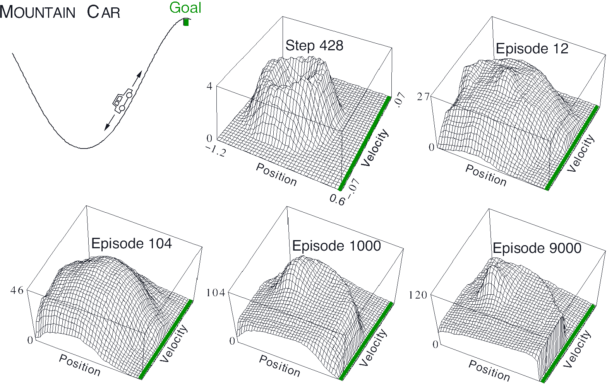

title: NPFL122, Lecture 5
class: title, langtech, cc-by-nc-sa
# Function Approximation, Deep Q Network

## Milan Straka

### November 12, 2018

---
section: Refresh
# $n$-step Methods

Full return is
$$G_t = ∑_{k=t}^∞ R_{k+1},$$
one-step return is
$$G_{t:t+1} = R_{t+1} + γ V(S_{t+1}).$$

We can generalize both into $n$-step returns:
$$G_{t:t+n} ≝ \left(∑_{k=t}^{t+n-1} γ^{k-t} R_{k+1}\right) + γ^n V(S_{t+n}).$$
with $G_{t:t+n} ≝ G_t$ if $t+n ≥ T$.

---
# $n$-step Sarsa

Defining the $n$-step return to utilize action-value function as
$$G_{t:t+n} ≝ \left(∑_{k=t}^{t+n-1} γ^{k-t} R_{k+1}\right) + γ^n Q(S_{t+n}, A_{t+n})$$
with $G_{t:t+n} ≝ G_t$ if $t+n ≥ T$, we get the following straightforward
update rule:
$$Q(S_t, A_t) ← Q(S_t, A_t) + α\left[G_{t:t+n} - Q(S_t, A_t)\right].$$

---
# Off-policy $n$-step Sarsa

Recall the relative probability of a trajectory under the target and behaviour policies,
which we now generalize as
$$ρ_{t:t+n} ≝ ∏_{k=t}^{\min(t+n, T-1)} \frac{π(A_k | S_k)}{b(A_k | S_k)}.$$

~~~
Then a simple off-policy $n$-step TD can be computed as
$$V(S_t) ← V(S_t) + αρ_{t:t+n-1}\left[G_{t:t+n} - V(S_t)\right].$$

~~~
Similarly, $n$-step Sarsa becomes
$$Q(S_t, A_t) ← Q(S_t, A_t) + αρ_{\boldsymbol{t+1}:\boldsymbol{t+n}}\left[G_{t:t+n} - Q(S_t, A_t)\right].$$

---
# Off-policy $n$-step Without Importance Sampling

We now derive the $n$-step reward, starting from one-step:
$$G_{t:t+1} ≝ R_{t+1} + ∑\nolimits_a π(a|S_{t+1}) Q(S_{t+1}, a).$$

~~~
For two-step, we get:
$$G_{t:t+2} ≝ R_{t+1} + γ∑\nolimits_{a≠A_{t+1}} π(a|S_{t+1}) Q(S_{t+1}, a) + γπ(A_{t+1}|S_{t+1})G_{t+1:t+2}.$$

~~~
Therefore, we can generalize to:
$$G_{t:t+n} ≝ R_{t+1} + γ∑\nolimits_{a≠A_{t+1}} π(a|S_{t+1}) Q(S_{t+1}, a) + γπ(A_{t+1}|S_{t+1})G_{t+1:t+n}.$$

---
# Function Approximation

We will approximate value function $v$ and/or state-value function $q$, choosing
from a family of functions parametrized by a weight vector $→w∈ℝ^d$.

We denote the approximations as
$$\begin{gathered}
  v̂(s, →w),\\
  q̂(s, a, →w).
\end{gathered}$$

~~~
We utilize the _Mean Squared Value Error_ objective, denoted $\overline{VE}$:
$$\overline{VE}(→w) ≝ ∑_{s∈𝓢} μ(s) \left[v_π(s) - v̂(s, →w)\right]^2,$$
where the state distribution $μ(s)$ is usually on-policy distribution.

---
# Gradient and Semi-Gradient Methods

The functional approximation (i.e., the weight vector $→w$) is usually optimized
using gradient methods, for example as
$$\begin{aligned}
  →w_{t+1} &← →w_t - \frac{1}{2} α ∇ \left[v_π(S_t) - v̂(S_t, →w_t)\right]^2\\
           &← →w_t - α\left[v_π(S_t) - v̂(S_t, →w_t)\right] ∇ v̂(S_t, →w_t).\\
\end{aligned}$$

As usual, the $v_π(S_t)$ is estimated by a suitable sample. For example in Monte
Carlo methods, we use episodic return $G_t$, and in temporal difference methods,
we employ bootstrapping and use $R_{t+1} + γv̂(S_{t+1}, →w).$

---
# Monte Carlo Gradient Policy Evaluation

---
# Linear Methods

A simple special case of function approximation are linear methods, where
$$v̂(→x(s), →w) ≝ →x(s)^T →w = ∑x(s)_i w_i.$$

The $→x(s)$ is a representation of state $s$, which is a vector of the same size
as $→w$. It is sometimes called a _feature vector_.

The SGD update rule then becomes
$$→w_{t+1} ← →w_t - α\left[v_π(S_t) - v̂(→x(S_t), →w_t)\right] →x(S_t).$$

---
# Feature Construction for Linear Methods

Many methods developed in the past:

- state aggregation,

- polynomials

- Fourier basis

- tile coding

- radial basis functions

But of course, nowadays we use deep neural networks which construct a suitable
feature vector automatically as a latent variable (the last hidden layer).

---
# State Aggregation

Simple way of generating a feature vector is _state aggregation_, where several
neighboring states are grouped together.

For example, consider a 1000-state random walk, where transitions go uniformly
randomly to any of 100 neighboring states on the left or on the right. Using
state aggregation, we can partition the 1000 states into 10 groups of 100
states. Monte Carlo policy evaluation then computes the following:

---
section: Tile Coding
# Tile Coding

If $t$ overlapping tiles are used, the learning rate is usually normalized as $α/t$.

---
# Tile Coding

For example, on the 1000-state random walk example, the performance of tile
coding surpasses state aggregation:

---
# Asymmetrical Tile Coding

In higher dimensions, the tiles should have asymmetrical offsets, with
a sequence of $(1, 3, 5, …, 2d-1)$ being a good choice.

---
section: Semi-Gradient TD
# Temporal Difference Semi-Gradient Policy Evaluation

In TD methods, we again use bootstrapping to estimate
$v_π(S_t)$ as $R_{t+1} + γv̂(S_{t+1}, →w).$

~~~

~~~
Note that such algorithm is called _semi-gradient_, because it does not
backpropagate through $v̂(S', →w)$.

---
# Temporal Difference Semi-Gradient Policy Evaluation

An important fact is that linear semi-gradient TD methods do not converge to
$\overline{VE}$. Instead, they converge to a different _TD fixed point_
$→w_\mathrm{TD}$.

~~~
It can be proven that
$$\overline{VE}(→w_\mathrm{TD}) ≤ \frac{1}{1-γ} \min_→w \overline{VE}(→w).$$

~~~
However, when $γ$ is close to one, the multiplication factor in the above bound
is quite large.

---
# Temporal Difference Semi-Gradient Policy Evaluation

As before, we can utilize $n$-step TD methods.

---
# Temporal Difference Semi-Gradient Policy Evaluation

---
# Sarsa with Function Approximation

Until now, we talked only about policy evaluation. Naturally, we can extend it
to a full Sarsa algorithm:

---
# Sarsa with Function Approximation

Additionally, we can incorporate $n$-step returns:

---
# Mountain Car Example

The performances are for semi-gradient Sarsa($λ$) algorithm (which we did not
talked about yet) with tile coding of 8 overlapping tiles covering position and
velocity, with offsets of $(1, 3)$.

---
# Mountain Car Example

---
section: Off-policy Divergence
# Off-policy Divergence With Function Approximation

Consider a deterministic transition between two states whose values are computed
using the same weight:

~~~
- If initially $w=10$, TD error will be also 10 (or nearly 10 if $γ<1$).
~~~
- If for example $α=0.1$, $w$ will be increased to 1 (by 10%).
~~~
- This process can continue indefinitely.

~~~
However, the problem arises only in off-policy setting, where we do not decrease
value of the second state from further observation.

---
# Off-policy Divergence With Function Approximation

The previous idea can be realized for instance by the following example.

---
# Off-policy Divergence With Function Approximation

---
section: DQN
# Deep Q Networks

Volodymyr Mnih et al.: _Playing Atari with Deep Reinforcement Learning_ (Dec 2013 on arXiv).

~~~
In 2015 accepted in Nature, as _Human-level control through deep reinforcement learning_.

~~~
Off-policy Q-learning algorithm with a convolutional neural network function
approximation of action-value function.

~~~
Training can be extremely brittle (and can even diverge as shown earlier).

---
# Deep Q Network

---
# Deep Q Network

---
# Deep Q Network

---
# Deep Q Network

---
# Deep Q Networks

- Preprocessing: $210×160$ 128-color images are converted to grayscale and
  then resized to $84×84$.
~~~
- Frame skipping technique is used, i.e., only every $4^\textrm{th}$ frame
  (out of 60 per second) is considered, and the selected action is repeated on
  the other frames.
~~~
- Input to the network are last $4$ frames (considering only the frames kept by
  frame skipping), i.e., an image with $4$ channels.
~~~
- The network is fairly standard, performing
  - 32 filters of size $8×8$ with stride 4 and ReLU,
  - 64 filters of size $4×4$ with stride 2 and ReLU,
  - 64 filters of size $3×3$ with stride 1 and ReLU,
  - fully connected layer with 512 units and ReLU,
  - output layer with 18 output units (one for each action)

---
# Deep Q Networks

- Network is trained with RMSProp to minimize the following loss:
  $$𝓛 ≝ 𝔼_{(s, a, r, s')∼\mathit{data}}\left[(r + γ \max_{a'} Q(s', a'; θ̄) - Q(s, a; θ))^2\right].$$
~~~
- An $ε$-greedy behavior policy is utilized.

~~~
Important improvements:
~~~
- experience replay: the generated episodes are stored in a buffer as $(s, a, r,
  s')$ quadruples, and for training a transition is sampled uniformly;
~~~
- separate target network $θ̄$: to prevent instabilities, a separate target
  network is used to estimate state-value function. The weights are not trained,
  but copied from the trained network once in a while;
~~~
- reward clipping of $(r + γ \max_{a'} Q(s', a'; θ̄) - Q(s, a; θ))$ to $[-1, 1]$.

---
class: tablefull
# Deep Q Networks Hyperparameters

| Hyperparameter | Value |
|----------------|-------|
| minibatch size | 32 |
| replay buffer size | 1M |
| target network update frequency | 10k |
| discount factor | 0.99 |
| training frames | 50M |
| RMSProp learning rate and momentum | 0.00025, 0.95 |
| initial $ε$, final $ε$ and frame of final $ε$ | 1.0, 0.1, 1M |
| replay start size | 50k |
| no-op max | 30 |
