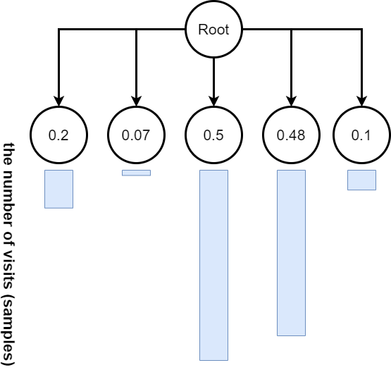
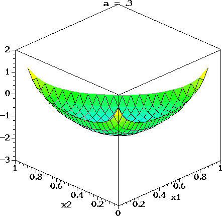

title: NPFL122, Lecture 10
class: title, langtech, cc-by-sa
# UCB, Monte Carlo Tree Search, AlphaZero

## Milan Straka

### December 07, 2020

---
section: UCB
# Upper Confidence Bound

Revisiting multi-armed bandits with $ε$-greedy exploration, we note that using
same epsilon for all actions in $ε$-greedy method seems inefficient.

~~~
One possible improvement is to select action according to upper confidence bound
(instead of choosing a random action with probability $ε$):
$$A_{t+1} ≝ \argmax_a \left[Q_t(a) + c\sqrt{\frac{\ln t}{N_t(a)}}\right],$$
where:
~~~
- $t$ is the number of times any action has been taken;
~~~
- $N_t(a)$ is the number of times the action $a$ has been taken;
~~~
- if $N_t(a) = 0$, the right expression is frequently assumed to have a value of
  $∞$.

~~~
The updates are then performed as before (e.g., using averaging, or fixed
learning rate $α$).

---
# Motivation Behind Upper Confidence Bound

Actions with little average reward are probably selected too often.

~~~
Instead of simple $ε$-greedy approach, we might try selecting an action as
little as possible, but still enough to converge.

~~~
Assuming that random variables $X_i$ bounded by $[0, 1]$ and $X̄ = \frac{1}{N} ∑_{i=1}^N
X_i$, (Chernoff-)Hoeffding's inequality states that
$$P\big(𝔼[X̄] - X̄ ≥ δ\big) ≤ e^{-2Nδ^2}.$$

~~~
Our goal is to choose $δ$ such that for every action,
$$P\big(Q_t(a) ≤ q_*(a) - δ\big) ≤ \left(\frac{1}{t}\right)^α.$$

~~~
We can fulfil the required inequality if $e^{-2N_t(a)δ^2} ≤ \left(\frac{1}{t}\right)^α$, which yields
$$δ ≥ α/2 ⋅ \sqrt{(\ln t)/N_t(a)}.$$

---
# Asymptotical Optimality of UCB

We define _regret_ as the difference of maximum of what we could get
(i.e., repeatedly using the action with maximum expectation) and
what a strategy yields, i.e.,
$$\textrm{regret}_N ≝ N \max_a q_*(a) - ∑_{i=1}^N 𝔼[R_i].$$

~~~
It can be shown that regret of UCB is asymptotically optimal,
see Lai and Robbins (1985), _Asymptotically Efficient Adaptive Allocation
Rules_; or the Chapter 8 of the 2018 _Bandit Algorithms Book_ available
online at https://banditalgs.com/.

---
# Upper Confidence Bound Multi-armed Bandits Results

---
# Multi-armed Bandits Comparison

---
section: MCTS
# Monte Carlo Tree Search

---
# Monte Carlo Tree Search

---
section: AlphaZero
# AlphaZero

On 7 December 2018, the AlphaZero paper came out in Science journal. It
demonstrates learning chess, shogi and go, _tabula rasa_ – without any
domain-specific human knowledge or data, only using self-play. The evaluation
is performed against strongest programs available.

---
# AlphaZero – Overview

AlphaZero uses a neural network predicting $(→p(s), v(s)) = f(s; →θ)$ for
a given state $s$, where:
- $→p(s)$ is a vector of move probabilities, and
~~~
- $v(s)$ is expected outcome of the game in range $[-1, 1]$.

~~~
Instead of the usual alpha-beta search used by classical game playing programs,
AlphaZero uses Monte Carlo Tree Search (MCTS).

~~~
By a sequence of simulated self-play games, the search can improve the estimate
of $→p$ and $v$, and can be considered a powerful policy evaluation operator
– given a network $f$ predicting policy $→p$ and value estimate $v$, MCTS
produces a more accurate policy $→π$ and better value estimate $w$ for a given
state $s$:
$$(→π(s), w(s)) ← \textrm{MCTS}(→p(s), v(s), f)\textrm{~~for~~}(→p(s), v(s)) = f(s; →θ).$$

---
# AlphaZero – Overview

The network is trained from self-play games.

~~~
A game is played by repeatedly running MCTS from a state $s_t$ and choosing
a move $a_t ∼ →π_t$, until a terminal position $s_T$ is encountered, which is
then scored according to game rules as $z∈\{-1, 0, 1\}$.

~~~
Finally, the network parameters are trained to minimize the error between the
predicted outcome $v$ and the simulated outcome $z$, and maximize the similarity of
the policy vector $→p$ and the search probabilities $→π$ (in other words, we
want to find a fixed point of the MCTS):
$$𝓛 ≝ (z - v)^2 - →π^T \log →p + c\|→θ\|^2.$$

~~~
The loss is a combination of:
- a mean squared error for the value functions;
- a crossentropy/KL divergence for the action distribution;
- L2 regularization.

---
section: A0-MCTS
# AlphaZero – Monte Carlo Tree Search

MCTS keeps a tree of currently explored states from a fixed root state.
~~~
Each node corresponds to a game state and to every non-root node we got
by performing an action $a$ from the parent state.
~~~
Each state-action pair $(s, a)$ stores the following set of statistics:
- visit count $N(s, a)$,
~~~
- total action-value $W(s, a)$,
~~~
- mean action value $Q(s, a) ≝ W(s, a) / N(s, a)$, which is usually not stored
  explicitly,
~~~
- prior probability $P(s, a)$ of selecting action $a$ in state $s$.

---
# AlphaZero – Monte Carlo Tree Search

Each simulation starts in the root node and finishes in a leaf node $s_L$.
In a state $s_t$, an action is selected using a variant of PUCT algorithm as
$$a_t = \argmax\nolimits_a \big(Q(s_t, a) + U(s_t, a)\big),$$
where
~~~
$$U(s, a) ≝ C(s) P(s, a) \frac{\sqrt{N(s)}}{1 + N(s, a)},$$
~~~
with $C(s) = \log\left(\frac{1+N(s)+c_\textrm{base}}{c_\textrm{base}}\right) + c_\textrm{init}$
being slightly time-increasing exploration rate.

~~~
The paper uses $c_\textrm{init} = 1.25$, $c_\textrm{base} = 19652$ without
any supporting experiments.

~~~
Also, the reason for the modification of the UCB formula was never discussed in
any AlphaZero paper and is not obvious.

---
# AlphaZero – Monte Carlo Tree Search

Additionally, exploration in the root state $s_\textrm{root}$ is supported by
including a random sample from Dirichlet distribution,
$$P(s_\textrm{root}, a) = (1-ε)p_a + ε\operatorname{Dir}(α),$$
with $ε=0.25$ and $α=0.3, 0.15, 0.03$ for chess, shogi and go, respectively.

~~~

Note that using $α<1$ makes the Dirichlet noise non-uniform, with a smaller
number of actions with high probability.

~~~
The Dirichlet distribution can be seen as a limit of the Pólya’s urn scheme,
where in each step we sample from a bowl of balls (with initial counts
$α$) and return an additional ball of the same color to the bowl.

~~~
To sample from a symmetric Dirichlet distribution, we can:
- sample $x_i$ from a Gamma distribution $x_i ∼ \operatorname{Gamma}(α)$,
~~~
- normalize the sampled values to sum to one, $p_i = \frac{x_i}{∑_j x_j}$.

---
# AlphaZero – Monte Carlo Tree Search

When reaching a leaf node $s_L$, we:
- evaluate it by the network, generating $(→p, v)$,
~~~
- add all its children with $N=W=0$ and the prior probability $→p$,
~~~
- in the backward pass for all $t ≤ L$, we update the statistics in nodes by performing
  - $N(s_t, a_t) ← N(s_t, a_t) + 1$, and
  - $W(s_t, a_t) ← W(s_t, a_t) ± v$, depending on the player on turn.

~~~

---
# AlphaZero – Monte Carlo Tree Search

The Monte Carlo Tree Search runs usually several hundreds simulations in
a single tree. The result is a distribution proportional to exponentiated visit
counts $N(s_\mathrm{root}, a)^\frac{1}{τ}$ using a temperature $τ$ ($τ=1$ is
mostly used), together with the predicted value function.

~~~
The next move is chosen as either:
- proportional to visit counts $N(s_\textrm{root}, ⋅)^\frac{1}{τ}$:
  $$→π_\textrm{root}(a) ∝ N(s_\textrm{root}, a)^\frac{1}{τ},$$
~~~
- deterministically as the most visited action
  $$→π_\textrm{root} = \argmax_a N(s_\textrm{root}, a).$$

~~~
During self-play, the stochastic policy is used for the first 30
moves of the game, while the deterministic is used for the rest of the moves.
(This does not affect the internal MCTS search, there we always sample
according to PUCT rule.)

---
# AlphaZero – Monte Carlo Tree Search Example

Visualization of the 10 most visited states in a MCTS with a given number of
simulations. The displayed numbers are predicted value functions from the
white's perspective, scaled to $[0, 100]$ range. The border thickness is
proportional to a node visit count.

---
section: A0-Network
# AlphaZero – Network Architecture

The network processes game-specific input, which consists of a history of
8 board positions encoded by several $N × N$ planes, and some number of
constant-valued inputs.

~~~
Output is considered to be a categorical distribution of possible moves. For
chess and shogi, for each piece we consider all possible moves (56 queen
moves, 8 knight moves and 9 underpromotions for chess).

~~~
The input is processed by:
- initial convolution block with CNN with 256 $3×3$ kernels with stride 1, batch
  normalization and ReLU activation,
~~~
- 19 residual blocks, each consisting of two CNN with 256 $3×3$ kernels with stride 1,
  batch normalization and ReLU activation, and a residual connection around
  them,
~~~
- _policy head_, which applies another CNN with batch normalization, followed by
  a convolution with 73/139 filters for chess/shogi, or a linear layer of size
  362 for go,
~~~
- _value head_, which applies another CNN with one $1×1$ kernel with stride 1,
  followed by a ReLU layer of size 256 and a final $\tanh$ layer of size 1.

---
# AlphaZero – Network Inputs

---
# AlphaZero – Network Outputs

---
section: A0-Training
# AlphaZero – Training

Training is performed by running self-play games of the network with itself.
Each MCTS uses 800 simulations. A replay buffer of one million most recent games
is kept.

~~~
During training, 5000 first-generation TPUs are used to generate self-play games.
Simultaneously, network is trained using SGD with momentum of 0.9 on batches
of size 4096, utilizing 16 second-generation TPUs. Training takes approximately
9 hours for chess, 12 hours for shogi and 13 days for go.

---
# AlphaZero – Training

---
# AlphaZero – Training

According to the authors, training is highly repeatable.

---
# AlphaZero – Symmetries

In the original AlphaGo Zero, symmetries (8 in total, using rotations and reflections) were explicitly utilized, by
- randomly sampling a symmetry during training,
~~~
- randomly sampling a symmetry during MCTS evaluation.

~~~
However, AlphaZero does not utilize symmetries in any way (because chess and
shogi do not have them).

---
section: A0-Evaluation
# AlphaZero – Inference

During inference, AlphaZero utilizes much less evaluations than classical game
playing programs.

---
# AlphaZero – Ablations

---
# AlphaZero – Ablations

---
# AlphaZero – Ablations

---
# AlphaZero – Preferred Chess Openings

